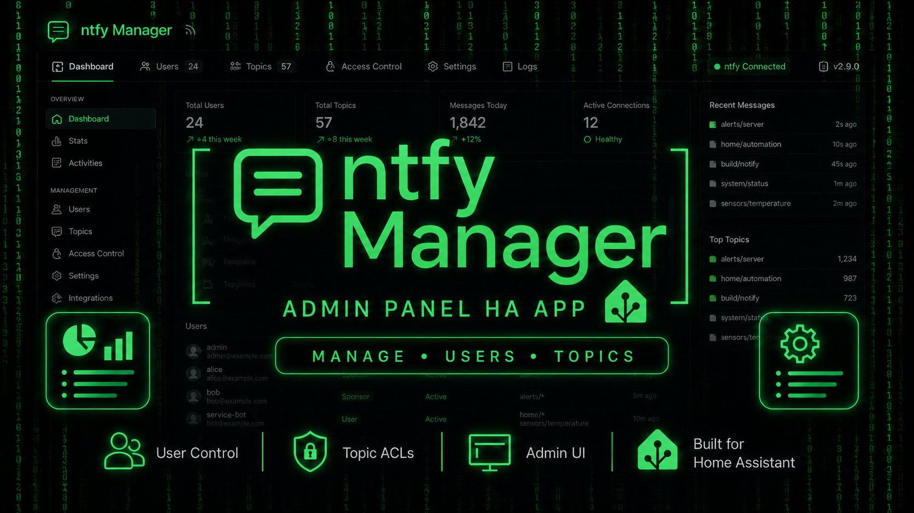

<div align="center">



# 🛠️ ntfy HAOS Admin Panel — Home Assistant Add-on

Vollwertiges Admin Control Panel für einen ntfy Server, der als HAOS Add-on läuft.

[](https://github.com/pol4rfuchs/ha-apps)
[](https://github.com/pol4rfuchs/ha-apps)
[](https://www.home-assistant.io/addons/)
[](https://github.com/binwiederhier/ntfy)
[](https://www.home-assistant.io/addons/)

</div>

---

## 🧭 Overview

| Property | Value |
|---|---|
| **HA Add-on Slug** | `ntfy_haos_admin_panel` |
| **App Version** | `0.2.13` |
| **Web UI Port** | `8099` (Ingress) |
| **Talks to** | `ntfy` add-on (same repo) |
| **Persistence** | `/data/jwt_secret` |

---

## Features

### Pages
- **Overview** — Health, Version, Stats, Uptime, User-Count, System-Status-Indikatoren
- **Send** — Topic + Title + Priority + Tags + Click + Live-Preview, Beispiel-Loader
- **Users** — Liste + Create + Delete + Change Password
- **Tokens** — Token erstellen mit optionalem Label & Expiry, Clipboard-Copy
- **Access Control** — Permission-Matrix mit User-Selector, Topic + Permission, Delete
- **Reservations** — Topic-Reservierung mit korrektem `{topic, everyone}`-Body
- **Server** — Health/Version-Info + auto-generierter HA `rest_command` YAML-Snippet
- **Messages** — Multi-Topic-Polling mit Stats, Since-/Limit-Filter, Topic-Settings via localStorage
- **Debug** — SSE-Monitor (Connect/Reconnect/Disconnect-Counter, Live-Log) + In-Memory-Audit-Feed

### Architektur
- **HA Add-on** — `ghcr.io/hassio-addons/base` (Alpine + s6-overlay + bashio)
- **Ingress Sidebar Panel** auf Port 8099, optional direkter Zugriff
- **Frontend** — React 18 + Vite + Tailwind, single-bundle SPA
- **Backend** — Express 4 + Zod + AES-256-GCM für stateless Cookie-Sessions
- **Auth** — Login-Form schreibt verschlüsselten Cookie mit ntfy-Credentials, oder lädt Defaults aus Add-on-Config
- **Keine zweite User-DB** — ntfy `user.db` ist die alleinige Wahrheit
- **Kein bcrypt, kein Prisma** — die einzige Persistenz ist `/data/jwt_secret`
- **SSE-Bridge** durch nginx → Express → ntfy `/sse` (durchgeschleift, kein Buffering)

## Architektur

```
┌──────────────────────────────────────────────────────┐
│ HAOS Add-on Container (Alpine + s6)                  │
│                                                      │
│  ┌──────────┐         ┌──────────────┐               │
│  │  nginx   │ ─────►  │ Express API  │               │
│  │  :8099   │ /api/*  │ :3000        │               │
│  │  (SPA)   │         │              │               │
│  └──────────┘         └──────┬───────┘               │
│       │                      │                       │
│       │ Ingress               │ HTTP                 │
│       ▼                      ▼                       │
│   Browser              ntfy:4280 (other add-on)      │
│                                                      │
└──────────────────────────────────────────────────────┘
```

## Installation

1. Repository zu Home Assistant hinzufügen: `https://github.com/pol4rfuchs/ha-apps`
2. Add-on installieren.
3. Konfigurieren — entweder ntfy-Credentials direkt im Add-on, oder leer lassen für interaktiven Login.
4. Starten — Sidebar-Eintrag „ntfy Admin" erscheint.

## Add-on Configuration

| Option | Default | Beschreibung |
|--------|---------|--------------|
| `ntfy_base_url` | `http://homeassistant.local:4280` | URL des ntfy-Servers |
| `ntfy_auth_type` | `basic` | `none`, `basic` oder `bearer` |
| `ntfy_username` | `""` | Default-Username (für `basic`) |
| `ntfy_password` | `""` | Default-Passwort (für `basic`) |
| `ntfy_bearer_token` | `""` | Default-Token (für `bearer`) |
| `default_topics` | `[ha-alerts, ha-info, ha-notify, ha-system, ha-planty]` | Default-Topics für Messages/SSE |
| `allow_login_override` | `true` | Erlaubt interaktiven Login zusätzlich zu Defaults |

## Auth-Flow

1. Add-on startet → `/data/jwt_secret` wird einmal generiert.
2. Browser öffnet Panel → ruft `/api/auth/status`.
3. Wenn ntfy-Credentials in Add-on-Config gesetzt: automatisch eingeloggt.
4. Wenn nicht: Login-Form — User gibt ntfy-Credentials ein.
5. Backend validiert per `GET /v1/account` gegen ntfy.
6. Bei Erfolg: AES-256-GCM-verschlüsselter Cookie mit ntfy-Authorization-Header.
7. Alle weiteren Calls gehen über Backend-Proxy mit dem Cookie-Auth.

## Security

- Cookie ist `httpOnly`, `sameSite: lax`, AES-256-GCM-verschlüsselt mit AEAD-Tag.
- `JWT_SECRET` wird einmal beim ersten Start in `/data/jwt_secret` generiert (Mode 0600).
- ntfy-Credentials werden NIE im LocalStorage gespeichert.
- Backend macht alle ntfy-Calls Server-zu-Server, das Frontend redet ausschließlich mit `/api/*`.
- Audit-Log ist in-memory only (max 500 Einträge), wandert in Supervisor-Log per console.

## Architectural Notes

- **Kein Prisma, kein SQLite, kein User-Store.** Wenn du Token-Auth willst — nutze ntfy direkt.
- **Kein Setup-Wizard** wie im alten Skeleton — der war in v0.1 das Login-System für die nicht-existente eigene User-DB. Nicht mehr nötig.
- **Reservation-Bug** vom alten HTML-Panel ist gefixt: POST `/v1/account/reservation` mit `{topic, everyone}` im Body, nicht im Pfad.
- **SSE läuft über `EventSource`** auf der Browser-Seite + `fetch` mit Stream-Reader im Backend. nginx passt den Buffer an (`proxy_buffering off`, `chunked_transfer_encoding off`, `proxy_read_timeout 24h`).


---

## 📜 License

The Home Assistant add-on wrapper, metadata, Dockerfile, scripts,
workflows, frontend, backend and documentation in this directory are
licensed under the Apache License 2.0.

The upstream ntfy project is not relicensed by this repository and remains
under its upstream license.

Upstream:

- ntfy: https://github.com/binwiederhier/ntfy
- Upstream license: See upstream repository

Third-party trademarks, logos, names and assets remain the property of
their respective owners.

See also:

- [`../LICENSE`](../LICENSE)
- [`../NOTICE`](../NOTICE)
- [`../THIRD_PARTY_NOTICES.md`](../THIRD_PARTY_NOTICES.md)